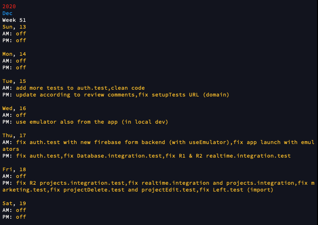

# git-report :rocket:

## Overview

This report is useful for automating `developpers activities reporting` based on `git commits`.

You can display it:

1. in your terminal

Or

2. send it to yourself via gmail.

## How to install

```bash
# install
curl "https://raw.githubusercontent.com/abeauvois/git-report/main/bin/gitreport" -o /usr/local/bin/gitreport && chmod +x /usr/local/bin/gitreport
# execute
gitreport console ./csv/gitlog.csv -v
```

## Todos

- [x] split/group each day by AM/ PM
- [x] make it installable
- [x] add year titles (`2020`) => remove month
- [x] add calendar week titles (`week 43`) => add a calendar day by day stream
- [ ] add calendar week titles (`Feb 12-23`) => find first and last day for a given week
- [ ] add `fromDate` parameter
- [ ] add `defaultMessage` parameter when AM or PM empty (ie 'meeting')
- [ ] add `makelog` command to exctract the `git log` csv file (from current branch)
- [ ] add `emailTo` parameter
- [ ] accept formatting options (ie "Day 5:" => "Thu 5, Nov 2020:")

## How to contribute

```bash
cd YOUR_FOLDER
git clone https://github.com/abeauvois/git-report.git
yarn
```

Or

```bash
cd YOUR_FOLDER
git clone https://github.com/abeauvois/git-report.git
npm i
```

### How to compile

```bash
# install the js compiler
yarn global add pkg

# run the compiler for your architecture (see details here: https://github.com/vercel/pkg)
 yarn build
```

### How to execute

```bash
 yarn exec

OR
# copy all files in ./bin
cp ./bin/ /usr/local/bin/
# then directly
gitreport console ./csv/gitlog.csv -v
```

## How to create a CSV file with a line of headers (in /csv folder)

```bash
 > echo sha, contributor, date, message > ./csv/gitlog.csv
```

- Append the CSV file with git log output, filtered by your `git username`

```bash
 > git log --date=local --pretty=format:'%h, %an, %ad, "%s"' | egrep {YOUR GIT USERNAME} >> ./csv/gitlog.csv

```

## 1. For a report in the terminal's console:

```bash
yarn start console ./csv/real-world-git-log.csv -v

# use your own csv file (produced by the git log command above)
yarn start console ./csv/{your_csv_file} -v
```

**You should see the following result in the terminal:**



## 2. For a report sent by email to yourself (via gmail):

It requires some devOps skills if you want to use `gmail` to send this report by email with it.

### Create an .env file (same place as package.json)

First, as we're using `gmail`, we have to setup a Google cloud project and get some key informations

Follow these instructions: https://medium.com/@nickroach_50526/sending-emails-with-node-js-using-smtp-gmail-and-oauth2-316fe9c790a1

The article explains `Why using Oauth2 and Google Dev App`

> many solutions required to go into my account settings and Enable Less Secure Apps. That sounded way too scary for me, especially considering I had been saved by Google’s security measures on more than a few occasions.
> So I found more efficient setting up OAuth2 for a Google Developer application and connecting it to the Nodemailer module using SMTP.

```bash
API_KEY=
API_SECRET=
GMAIL_EMAIL=
GMAIL_PASSWORD=
GOOGLE_CLIENT_ID=
GOOGLE_CLIENT_SECRET=
GOOGLE_CLIENT_REFRESH_TOKEN=
PROJECT_NUMBER=
```

## Send

```bash
yarn start gmail ./csv/real-world-git-log.csv -v
```
